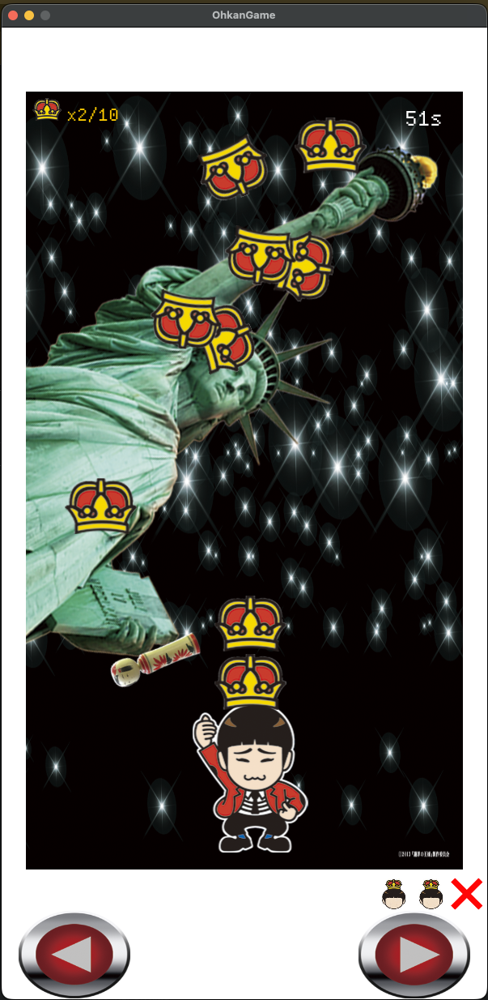

# OhkanGame (Rust)

A faithful Rust port of the original **OhkanGame** — a Flash/ActionScript 3 game developed in 2013.



## Overview

The original game was built with Adobe Flash (ActionScript 3) and published around 2013.  
This version reimplements it entirely in **Rust** using the [macroquad](https://github.com/not-fl3/macroquad) game framework, preserving the original gameplay, collision logic, and sprite behavior as accurately as possible.

## Gameplay

- Move the character left/right to catch falling crowns on your head
- Stack 10 crowns to win
- Avoid the giant Kokeshi and the Statue of Liberty sweeping your crown stack
- 3 lives — small Kokeshi hits cost a life
- 90-second time limit

## Controls

| Input | Action |
|-------|--------|
| ← / A | Move left |
| → / D | Move right |
| On-screen buttons | Move left / right (touch/mouse) |
| Space / Enter | Start game (title screen) |

## Tech Stack

- **Language**: Rust (100%)
- **Framework**: [macroquad](https://github.com/not-fl3/macroquad) 0.4
- **Platform**: macOS (arm64 / x86_64)
- **Build**: Cargo

## Build

```bash
cargo run
```

### macOS .app bundle (arm64)

```bash
SDK=/Applications/Xcode.app/Contents/Developer/Platforms/MacOSX.platform/Developer/SDKs/MacOSX.sdk
CLANG=/Applications/Xcode.app/Contents/Developer/Toolchains/XcodeDefault.xctoolchain/usr/bin/clang
SDKROOT="$SDK" \
CARGO_TARGET_AARCH64_APPLE_DARWIN_LINKER="$CLANG" \
RUSTFLAGS="-C link-arg=-isysroot -C link-arg=$SDK -C link-arg=-mmacosx-version-min=13.0" \
cargo build --release --target aarch64-apple-darwin
cp target/aarch64-apple-darwin/release/RustOhkanGame RustOhkanGame.app/Contents/MacOS/RustOhkanGame
touch RustOhkanGame.app
```

## Original

- Original Flash game: [TobiSyazaiFlash](https://github.com/tobisako/TobiSyazaiFlash)
- Original language: ActionScript 3 (Adobe Flash)
